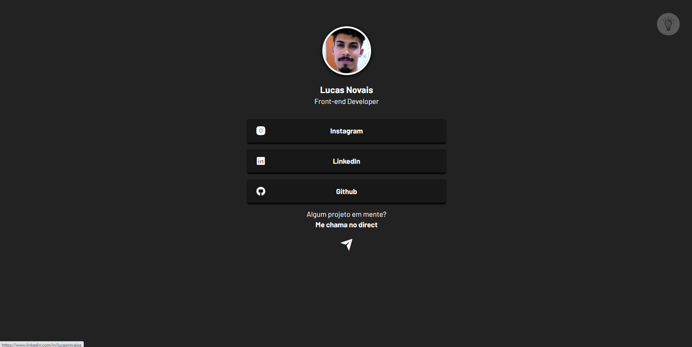

<h1 align="center"> Página de Links </h1>

Evento exclusivo e gratuito, promovido pelo Bruno Cupertino para ensino de tecnologias WEB.

  <a href="#-tecnologias">Tecnologias</a>&nbsp;&nbsp;&nbsp;|&nbsp;&nbsp;&nbsp;
  <a href="#-projeto">Projeto</a>&nbsp;&nbsp;&nbsp;|&nbsp;&nbsp;&nbsp;
  <a href="#-layout">Layout</a>&nbsp;&nbsp;&nbsp;|&nbsp;&nbsp;&nbsp;
  <a href="#memo-licença">Licença</a>

  

 

  

  

## 🚀 Tecnologias

Esse projeto foi desenvolvido com as seguintes tecnologias:

- HTML e CSS
- JavaScript
- Git e Github

## 💻 Projeto

A Página de Links é um projeto simples em que contém links que redirecionam para as redes sociais de uma pessoa e/ou empresa.

## 🔖 Layout

Você pode visualizar o projeto através [DESSE LINK](<https://barralukas.github.io/linkPage/>)

## :memo: Licença

Esse projeto está sob a licença MIT.
